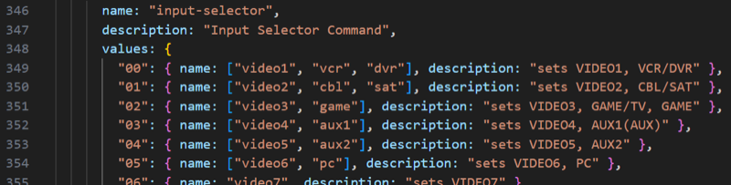

## Cheats

## Simple commands

As from v0.9.0 this integration creates a list of `simple commands` (like PRESET_15, DIRAC_SLOT1, LISTENING_MODE_STEREO, INPUT_FM) which are available for you in Web Configurator.

## Text commands

If you cannot find a command in the dropdown list, but you see that command in [this JSON](../src/eiscp-commands.ts), you can send it as text command.

In an Activity goto `User interface`, add `Text Button` and select `Input source` (or select `Input source` in on/off sequence), because `Input source` next to the selectable commands/sources also accepts text input, we can give all kinds of commands, like presets or input sources.

Based on how you configured the [Input Select](./select-input-selector.md), the `Input source` will show a dropdown, you can however still enter commands instead of selecting an option from dropdown. For example in the [JSON](../src/eiscp-commands.ts) is mentioned `dimmer-level` with possible value `dim`, let's give it a try: yes the AVR display dims to the next level!

Another example is the text command alternative for selecting a source:

Some examples to explain how to interpret that list:

| I want to select on AVR | Value(s) in JSON ('name')  | Value to enter into `Input source` |
| ----------------------- | -------------------------- | ---------------------------------- |
| CBL/SAT                 | `video2` or `cbl` or `sat` | `input-selector cbl`               |
| BD/DVD                  | `bd` or `dvd`              | `input-selector bd`                |
| STMBOX                  | `stm`                      | `input-selector stm`               |
| TV                      | `tv`                       | `input-selector tv`                |
| GAME                    | `video3` or `game`         | `input-selector game`              |
| NET                     | `net` or `network`         | `input-selector net`               |

## Raw commands

If the command you want to send is not yet mentioned in the JSON but you do know the details you can still send it as [raw command](./raw.md).
