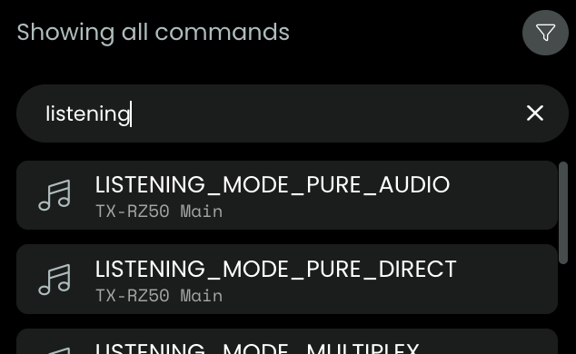

## Listening modes

## Select from list

As from v0.9.0 listening modes are available as so called [simple commands](generated-simplecommands.md):

## What about `Dolby Atmos`, `DTS:X`, `Auro-3D`, `IMAX Enhanced`?

eISCP codes for Atmos, DTS:X, Auro-3D, and IMAX Enhanced are not standardized and may vary by receiver model and firmware.

However, most models `auto-select` the correct mode when the input signal is `Dolby Atmos`, `DTS:X`, `Auro-3D`, `IMAX Enhanced` and the listening mode is set to `Straight Decode`.

| Listening mode | Setup           |
| -------------- | --------------- |
| Dolby Atmos    | straight-decode |
| DTS:X          | straight-decode |
| Auro-3D        | straight-decode |
| IMAX Enhanced  | straight-decode |

## Select widget

As from version 0.8.0, the integration offers a `select` widget for listening modes, see [this doc](select-listening-mode.md).

Different models sometimes use different names for a single listening mode.

## Example of known Pioneer listening modes

| Listening modes known to be accepted by Pioneer |
| ----------------------------------------------- |
| direct                                          |
| dolby-surround                                  |
| dolby-surround-classical                        |
| dolby-surround-drama                            |
| dolby-surround-entertainment-show               |
| dolby-surround-front-stage-surround             |
| dolby-surround-sports                           |
| dolby-surround-unplugged                        |
| dts-neural:x                                    |
| extended-mono                                   |
| extended-stereo                                 |
| mono                                            |
| pure-direct                                     |
| stereo                                          |
