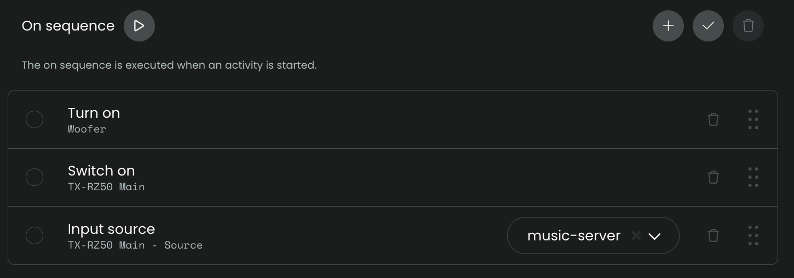
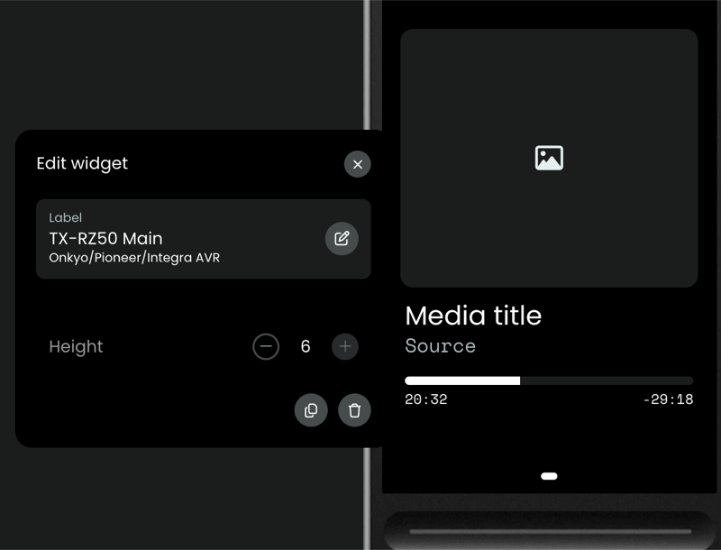
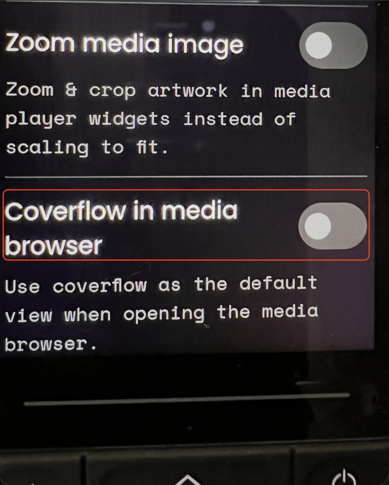
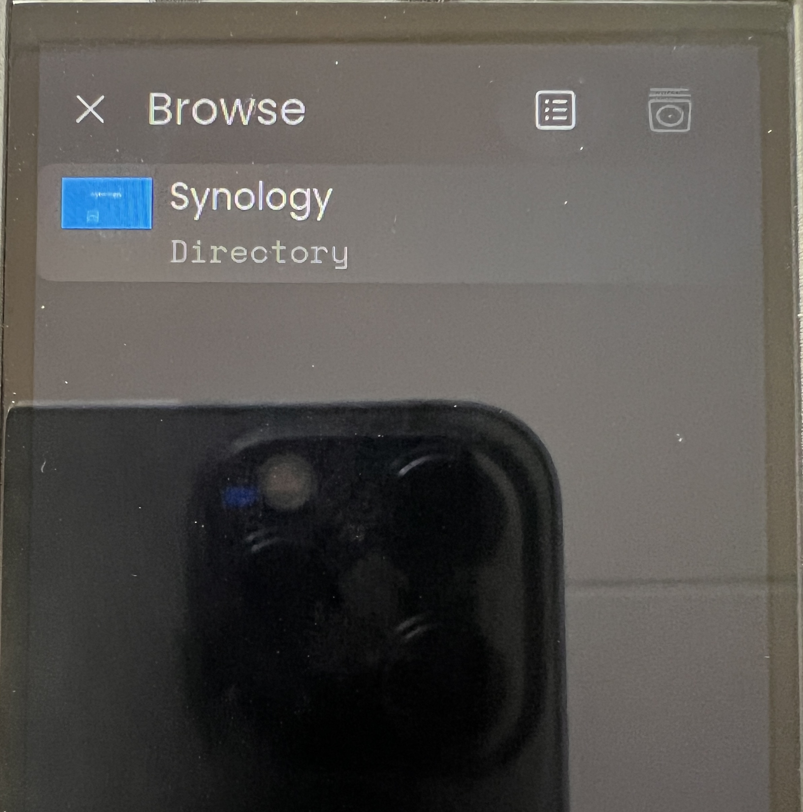
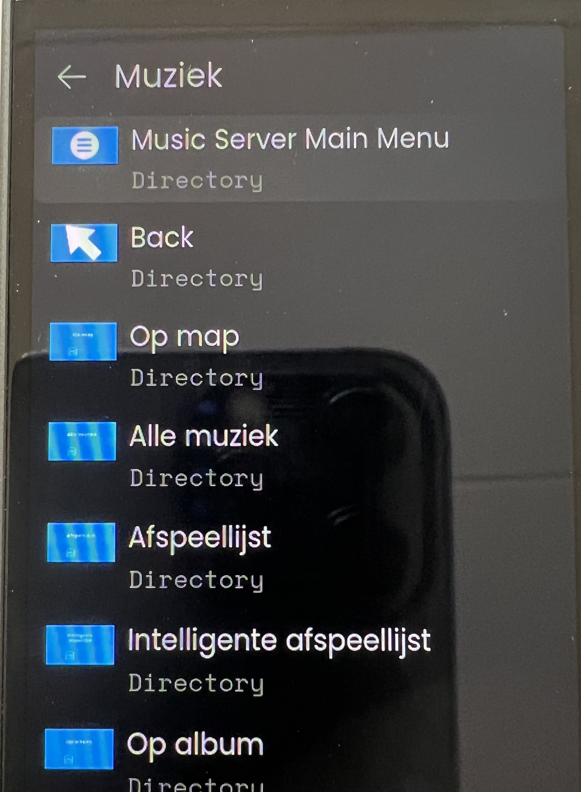
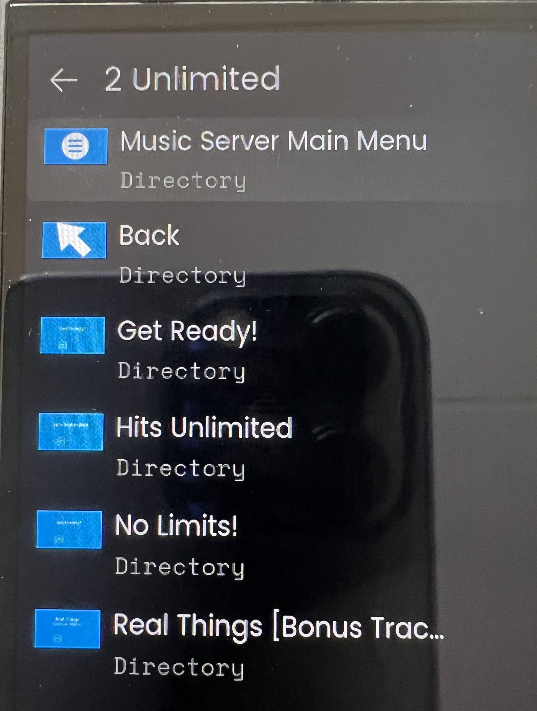
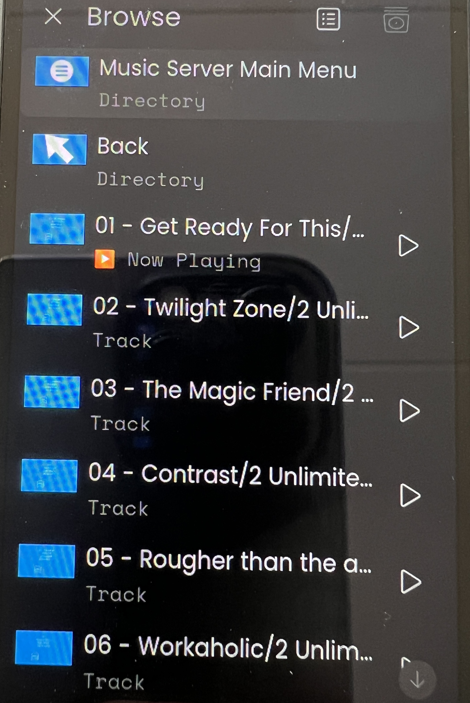

## Music-server

If your AVR has the option to browse and select songs from a `music server`, this integration can be used to browse that server through your AVR.

This integration will try to collect the artist, title and album. All this is collected from the AVR, this integration does not communicate with your Music Server directly. All commands, like `browse`, `play/pause`, `next` and `previous`, will be send to the AVR, the AVR will handle the communication with your Music Server

### Music-server activity

To set up an Activity for Music-server, have a look at these screenshots:

- Create activity and prevent sleep

  

- On sequence, Input source: select `music-server`

  

- User interface, add mediawidget for the AVR with maximum size

  

- Button mapping: map to the buttons you prefer (for example previous/next can be mapped to channel up/down):
  - volume up/down
  - play/pause
  - previous/next
  - mute

    

Commands on the remote will only work if you can also use those commands directly in your AVR app.

### Change setting directly on the Unfolded Circle Remote

It's recommended to _disable_ the setting `Coverflow in media browser` to get the best experience for navigating the Music-server menu through this integration. To do so, click in the top right corner of the screen on the remote, select Settings > User Interface > Coverflow in media browser: off.

### Browse Music-server

The mediabrowser of Unfolded Circle combined with your AVR being able to browse the Music-server service make it possibe to scroll through the Music Server menu just like you would do with the Controller app of your AVR or navigating the menu on your AVR using your TV.

Some screenshots:

**When you want to go back in menu options, it's best to use `Music-server Main Menu` or `Back` at the top of the options, the back button in the Media Browser itself does not yet set the AVR state one step back in menu navigation so you could get into unexpected behavior using the back option of the Media Browser.**

### Note

If selecting `music-server` as Input source does not work, check the manual of your AVR to see if Music Server is even available as selectable input on the AVR:

- your AVR _does_ have a music-server input: run setup of this integration again and increase the value for 'NET sub-source selection delay'
- your AVR does _not_ have a `music-server` input, this setup is not possible
